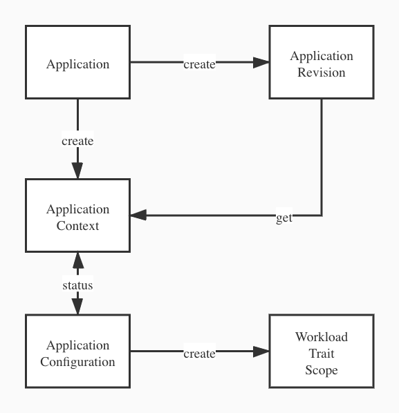

# ApplicationContext

## 说明

ApplicationContext，该对象的存在主要用于替换 ApplicationConfigmap对象，目前控制器内的代码在 ApplicationConfigmap 控制器外面 wrap 一层，setup 代码里面默认加载 ApplicationContext 控制器，只有 vela 启动是配置 `--app-config-installed=true`，才会启动 ApplicationConfigmap 控制器。

## CRD

```go
// ApplicationContextSpec is the spec of ApplicationContext
type ApplicationContextSpec struct {
   // ApplicationRevisionName points to the snapshot of an Application with all its closure
  // 配置 application 的 revision name，后续用于查询 applicationConfigmap 对象
   ApplicationRevisionName string `json:"applicationRevisionName"`
}

// ApplicationContext is the Schema for the ApplicationContext API
// +kubebuilder:object:root=true
// +kubebuilder:resource:shortName=appcontext,categories={oam}
// +kubebuilder:subresource:status
type ApplicationContext struct {
   metav1.TypeMeta   `json:",inline"`
   metav1.ObjectMeta `json:"metadata,omitempty"`

   Spec ApplicationContextSpec `json:"spec,omitempty"`
   // we need to reuse the AC status
  // 此处 status 用于状态传递的中转
   Status ApplicationConfigurationStatus `json:"status,omitempty"`
}

// ApplicationContextList contains a list of ApplicationContext
// +kubebuilder:object:root=true
type ApplicationContextList struct {
   metav1.TypeMeta `json:",inline"`
   metav1.ListMeta `json:"metadata,omitempty"`
   Items           []ApplicationContext `json:"items"`
}
```

## Reconcile

```go
// Reconcile reconcile an application context
func (r *Reconciler) Reconcile(request reconcile.Request) (reconcile.Result, error) {
	r.log.Debug("Reconciling")
	ctx, cancel := context.WithTimeout(context.Background(), reconcileTimeout)
	defer cancel()
	// fetch the app context
  // ApplicationContext 对象由 application 创建，并制定 revision name
	appContext := &v1alpha2.ApplicationContext{}
  // 获取 ApplicationContext 对象
	if err := r.client.Get(ctx, request.NamespacedName, appContext); err != nil {
		...
	}

	ctx = util.SetNamespaceInCtx(ctx, appContext.Namespace)
  // 创建 discovery client 供后面 ApplicationConfiguration ACReconcile 使用
	dm, err := discoverymapper.New(r.mgr.GetConfig())
	if err != nil {
		return reconcile.Result{}, fmt.Errorf("create discovery dm fail %w", err)
	}
	// fetch the appRevision it points to
  // 获取上面指定的 revision name
	appRevision := &v1alpha2.ApplicationRevision{}
	key := types.NamespacedName{Namespace: appContext.Namespace, Name: appContext.Spec.ApplicationRevisionName}
	if err := r.client.Get(ctx, key, appRevision); err != nil {
		...
	}

	// copy the status from appContext to appConfig
  // 获取 ApplicationRevision spec 中 ApplicationConfiguration ，并转换成对象
	appConfig, err := util.RawExtension2AppConfig(appRevision.Spec.ApplicationConfiguration)
	if err != nil {
		return reconcile.Result{}, err
	}
  // 传递 ApplicationContext 中的status 到 ApplicationConfiguration 中
	appConfig.Status = appContext.Status
	// the name of the appConfig has to be the same as the appContext
	appConfig.Name = appContext.Name
	appConfig.UID = appContext.UID
	appConfig.SetLabels(appContext.GetLabels())
	appConfig.SetAnnotations(appContext.GetAnnotations())
	// makes sure that the appConfig's owner is the same as the appContext
	appConfig.SetOwnerReferences(appContext.GetOwnerReferences())
	// call into the old ac Reconciler and copy the status back
  // 填充 ApplicationConfiguration 完毕之后，交由 ApplicationConfiguration 进行 Reconcile
	acReconciler := ac.NewReconciler(r.mgr, dm, r.log, ac.WithRecorder(r.record), ac.WithApplyOnceOnlyMode(r.applyMode))
	reconResult := acReconciler.ACReconcile(ctx, appConfig, r.log)
  // 将 Reconcile 完当前 status 回写给 ApplicationContext 对象
	appContext.Status = appConfig.Status
	// always update ac status and set the error
  // 更新 ApplicationContext 对象
	err = errors.Wrap(r.client.Status().Update(ctx, appContext), errUpdateAppContextStatus)
	// use the controller build-in backoff mechanism if an error occurs
	if err != nil {
		reconResult.RequeueAfter = 0
	} else if appContext.Status.RollingStatus == types2.RollingTemplated {
		// makes sure that we can will reconcile shortly after the annotation is removed
		reconResult.RequeueAfter = time.Second * 5
	}
	return reconResult, err
}
```

ApplicationContext Reconcile 基本逻辑如下：

1. 获取 ApplicationContext 对象；
2. 获取 ApplicationContext  指定的 revision name；
3. 获取 ApplicationRevision spec 中 ApplicationConfiguration ，并转换成对象；
4. 传递 ApplicationContext 中的status 到 ApplicationConfiguration 中；
5. 填充 ApplicationConfiguration 完毕之后，交由 ApplicationConfiguration 进行 Reconcile；
6. 将 Reconcile 完当前 status 回写给 ApplicationContext 对象；
7. 更新 ApplicationContext 对象
8. ApplicationContext  Reconcile 执行完毕


## Transition

