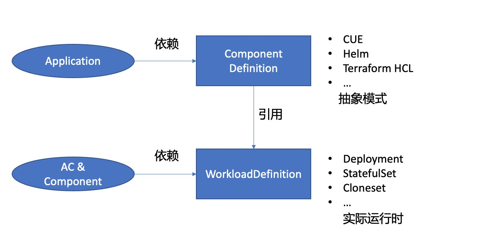
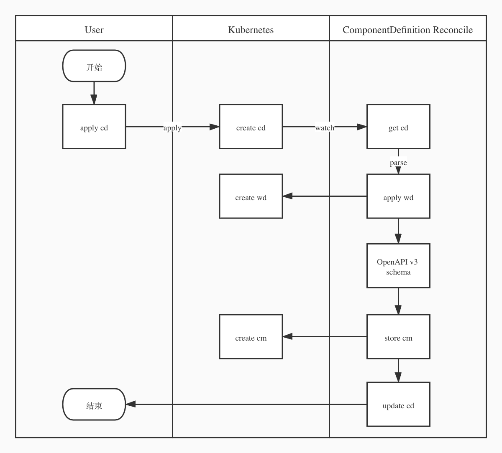

# ComponentDefinition（cd）

## 说明

ComponentDefinition，该资源在 `oam v1beta1` 中出现，之前 `v1alpha2` 该资源名字为 `WorkloadDefinition`，而 `WorkloadDefinition` 将回归到最初的设计，只对底层 `workload` 提供注册能力，所有基于 `workload` 的二次封装和模版抽象都由 `ComponentDefinition` 进行接手。当然基于历史原因目前版本还是做了兼容，当指定 `ComponentDefinition` 找不到的时候，会再找一次同名的 `WorkloadDefinition` ， 下图为社区提供的两者关系。



该资源主要用于定义工作负载模版，其中包含：模版、参数、工作负载运维特性（Trait）三种信息。

目前模版部分支持三种 `schematic` : kube、cue、helm，下面我们就开始介绍这三种

- Kube，该类型用于支持 kubernetes 资源定义方式，template 部分就可以是 deployment 的 yaml 定义，parameters 部分定义需要暴露给用户自定义的字段，官方示例如下：

  ```yaml
  apiVersion: core.oam.dev/v1beta1
  kind: ComponentDefinition
  metadata:
    name: kube-worker
    namespace: default
  spec:
    workload: 
      definition: 
      // 此处需要定义工作负载的gvk信息
        apiVersion: apps/v1
        kind: Deployment
    schematic:
      kube: 
      // 此处模版就是 deployment 的 yaml
        template:
          apiVersion: apps/v1
          kind: Deployment
  ... 
        // 定义需要暴露的参数
        parameters: 
        // 这里暴露镜像地址字段
        - name: image
        	// 此项为必填项
          required: true
          // 该字段类型为字符串
          type: string
          // 需要替换字段的具体路径，该字段值将被此参数的值覆盖
          fieldPaths: 
          - "spec.template.spec.containers[0].image"
  
  ```

- cue，该类型用于支持 cue 进行模版定义，template  部分包含模版部分和参数部分，官方示例如下：

  ```yaml
  apiVersion: core.oam.dev/v1beta1
  kind: ComponentDefinition
  metadata:
    name: stateless
  spec:
    workload:
      definition:
      // 定义工作负载gvk
        apiVersion: apps/v1
        kind: Deployment
    schematic:
      cue:
        template: |
        // 自定义参数定义
          parameter: {
          	name:  string
          	image: string
          }
          output: {
          	apiVersion: "apps/v1"
          	kind:       "Deployment"
          	spec: {
          		selector: matchLabels: {
          		// 引用自定义参数 name
          			"app.oam.dev/component": parameter.name
          		}
          		template: {
          			metadata: labels: {
          			// 引用自定义参数
          				"app.oam.dev/component": parameter.name
          			}
          			spec: {
          				containers: [{
          					name:  parameter.name
          					image: parameter.image
          				}]
          			}
          		}
          	}
          }
  ```

  关于 cue 模版的写法可以参考本公众号之前文章[CUE 制作模版](https://mp.weixin.qq.com/s/F-i5YGuJ5CBjd4-vMGrP9w)，文中有详细讲解。

- helm，该类型主要用于支持 helm chart 作为模版定义，release 部分用于定义 chart 名称和版本， repository 用于定义 helm 仓库地址。该类型下使用第三方组件 [fluxcd/flux2](https://github.com/oam-dev/kubevela/blob/cbc866ccaedcde05d084b80d60b7ee3356b1acaf/docs/en/install.md#3-optional-install-flux2) 对 helm chart  进行生命周期管理。官方示例如下：

  ```yaml
  apiVersion: core.oam.dev/v1beta1
  kind: ComponentDefinition
  metadata:
    name: webapp-chart
    annotations:
      definition.oam.dev/description: helm chart for webapp
  spec:
    workload:
    // 用于定义helm chart 中基础
      definition:
        apiVersion: apps/v1
        kind: Deployment
    schematic:
      helm:
        release:
        // 定义 helm chart 信息
          chart:
            spec:
              chart: "podinfo"
              version: "5.1.4"
        // 定义 helm repo 信息
        repository:
          url: "http://oam.dev/catalog/"
  ```

  

## CRD

```go
// ComponentDefinitionSpec defines the desired state of ComponentDefinition
type ComponentDefinitionSpec struct {
	// Workload is a workload type descriptor
  // 该字段提供两种方式引用 workload：
  // 1. 引用 WorkloadDefinition 
  // 2. 手动定义底层 workload gvk 信息
	Workload common.WorkloadTypeDescriptor `json:"workload"`

	// ChildResourceKinds are the list of GVK of the child resources this workload generates
  // 用于定义子资源gvk信息，比如包含：deployment、service就可以这么定义
  // childResourceKinds:
  //  - apiVersion: apps/v1
  //    kind: Deployment
  //  - apiVersion: v1
  //    kind: Service
	ChildResourceKinds []common.ChildResourceKind `json:"childResourceKinds,omitempty"`

	// RevisionLabel indicates which label for underlying resources(e.g. pods) of this workload
	// can be used by trait to create resource selectors(e.g. label selector for pods).
	// +optional
  // 该字段主要用于指定最底层资源用于选择的标签，比如当前 workload 包含 pod，这里就可以写 pod 上的标签key
	RevisionLabel string `json:"revisionLabel,omitempty"`

	// PodSpecPath indicates where/if this workload has K8s podSpec field
	// if one workload has podSpec, trait can do lot's of assumption such as port, env, volume fields.
	// +optional
  // 该字段用于定义 pod spec path，比如 deployment pod spec path 为 spec.template.spec，但是如果是crd，则有可能不一样。其实这个字段主要用于指定 crd 中需要透传给 pod 的配置
	PodSpecPath string `json:"podSpecPath,omitempty"`

	// Status defines the custom health policy and status message for workload
	// +optional
  // 该字段定义 workload 自定义健康检查策略和状态信息
	Status *common.Status `json:"status,omitempty"`

	// Schematic defines the data format and template of the encapsulation of the workload
	// +optional
  // 该字段用于定义 workload 抽象部分，这部分支持：kube、cue、helm 三种模式，就是开头我们说的三种模式。
	Schematic *common.Schematic `json:"schematic,omitempty"`

	// Extension is used for extension needs by OAM platform builders
	// +optional
  // 用于 oam 平台扩展，目前还有基于该字段的逻辑
	// +kubebuilder:pruning:PreserveUnknownFields
	Extension *runtime.RawExtension `json:"extension,omitempty"`
}

// ComponentDefinitionStatus is the status of ComponentDefinition
type ComponentDefinitionStatus struct {
	// ConditionedStatus reflects the observed status of a resource
	runtimev1alpha1.ConditionedStatus `json:",inline"`
	// ConfigMapRef refer to a ConfigMap which contains OpenAPI V3 JSON schema of Component parameters.
  // 该项主要用于记录 Schematic 转换成 OpenAPI v3 schema 的 configmap 名字
	ConfigMapRef string `json:"configMapRef,omitempty"`
}

```

## Reconcile



```go
// Reconcile is the main logic for ComponentDefinition controller
// ComponentDefinition 后面简称为 cd，WorkloadDefinition 简称 wd
func (r *Reconciler) Reconcile(req ctrl.Request) (ctrl.Result, error) {
	definitionName := req.NamespacedName.Name
	klog.InfoS("Reconciling ComponentDefinition", "Name", definitionName, "Namespace", req.Namespace)
	ctx := context.Background()

  // 获取当前 cd 对象
	var componentDefinition v1alpha2.ComponentDefinition
	if err := r.Get(ctx, req.NamespacedName, &componentDefinition); err != nil {
		if kerrors.IsNotFound(err) {
			err = nil
		}
		return ctrl.Result{}, err
	}
	// 如果 ComponentDefinition 对象已经标记待销毁，则退出 reconcile
  
  // 初始化 handler 对象，包含 k8s client 和 cd 对象
	handler := handler{
		Client: r.Client,
		dm:     r.dm,
		cd:     &componentDefinition,
	}

  // 获取当前 cd 的 workload type 以及 查询新建 wd
	workloadType, err := handler.CreateWorkloadDefinition(ctx)
	if err != nil {
		...
	}
	klog.InfoS("Successfully create WorkloadDefinition", "name", componentDefinition.Name)

  // 填充 CapabilityComponentDefinition 对象，该对象为 cd 控制器内映射的内部结构体
	var def utils.CapabilityComponentDefinition
	def.Name = req.NamespacedName.Name
	def.WorkloadType = workloadType
	def.ComponentDefinition = componentDefinition
	switch workloadType {
	case util.ReferWorkload:
		def.WorkloadDefName = componentDefinition.Spec.Workload.Type
	case util.HELMDef:
		def.Helm = componentDefinition.Spec.Schematic.HELM
	case util.KubeDef:
		def.Kube = componentDefinition.Spec.Schematic.KUBE
	default:
	}
  // 以上 CapabilityComponentDefinition 对象数据填充完毕，现在开始将定义的 Schematic 转换成 OpenAPI v3 schema，并存储到 cm 中，此处的 cm 主要方便前端进行获取。
	err = def.StoreOpenAPISchema(ctx, r, req.Namespace, req.Name)
	if err != nil {
		klog.ErrorS(err, "cannot store capability in ConfigMap")
		r.record.Event(&(def.ComponentDefinition), event.Warning("cannot store capability in ConfigMap", err))
		return ctrl.Result{}, util.PatchCondition(ctx, r, &(def.ComponentDefinition),
			cpv1alpha1.ReconcileError(fmt.Errorf(util.ErrStoreCapabilityInConfigMap, def.Name, err)))
	}

  // 更新 cd ，上一步填充了 ConfigMapRef ，需要提交更新
	if err := r.Status().Update(ctx, &def.ComponentDefinition); err != nil {
	...
	}
	klog.Info("Successfully stored Capability Schema in ConfigMap")

	return ctrl.Result{}, nil
}
```

